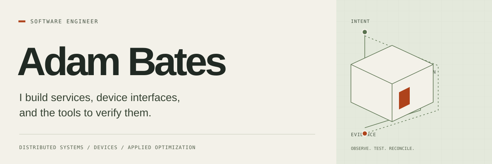

<picture>
  <source media="(max-width: 600px)" srcset="assets/engineering-mobile.svg">
  
</picture>

I’m Adam, a Senior Software Engineer. My work spans Java/Spring Boot and Kafka
services at JPMorgan Chase, customer-facing ATM interfaces and device integration
at Capital One, and Python NLP services at Width.ai. At Capital One, I led the
ATM interface modernization team, supervised its work, and helped team members
understand the ATM architecture. I also built Python/Playwright automation to
check interface behavior and visual changes on QA hardware. My master’s research
adds a different angle: optimization under resource and delay constraints.

Much of my professional work lives in proprietary employer repositories. My
public activity captures only part of that experience, so I use these independent
projects to show my design decisions, tests, and experimental results.

## Start with my [Device Recovery Lab](https://github.com/B8Z/device-recovery-lab)

**If a device acts but its response disappears, how should the service recover?**

I built a simulated parcel-locker workflow that puts the service’s knowledge
beside the device’s actual state. A timeline follows each command through receipt,
action, and recovery. When a response is missing, the service checks the device’s
execution journal before deciding whether to send the command again.

*This is a captured run. The device panel is diagnostic instrumentation; the
recovery service cannot use that view to decide completion.*

| Try a failure | Inspect the decision |
| --- | --- |
| Duplicate command | The device recognizes the same command ID and suppresses a second action. |
| Lost acknowledgment | The service reconciles the completed action without sending it again. |
| Disconnected device | Recovery backs off, then checks the journal when the link returns. |

For this October 2026 demonstration, I chose two Python processes, HTTP, and
separate SQLite journals. [Run it locally](https://github.com/B8Z/device-recovery-lab#run-it)
with `python run.py`; no cloud account or runtime package installation is needed.

**Where I’d start in the source:** the
[expected behavior](https://github.com/B8Z/device-recovery-lab/blob/main/docs/behavior.md),
the [recovery decisions](https://github.com/B8Z/device-recovery-lab/blob/main/lab/service.py),
and the [tests](https://github.com/B8Z/device-recovery-lab/blob/main/docs/testing.md).
I recorded one simulated pulse in each of [32 trials](https://github.com/B8Z/device-recovery-lab/tree/main/measurements)
in October 2026. The data shows the recovery work under those settings. This is
my own simulation with [explicit hardware limits](https://github.com/B8Z/device-recovery-lab#limits-and-next-questions),
not an employer system or an exactly-once claim.

## My research: optimization under constraints

For my **2022 master’s thesis at Christopher Newport University**, I developed a
genetic algorithm and a VNF placement heuristic in Python using NumPy and
NetworkX. I compared the approach with a Gurobi MILP model to examine how
solution quality and runtime vary with network, workload, and resource-sharing
configuration.

**[A Genetic Algorithm for the Optimization of Service Provisioning in Multi-Layer Fog Networks](research/fog-network-thesis.md)**

I explain the problem and configuration-dependent tradeoffs in the research
note, updated in October 2026. I haven’t reproduced the original experiments here.

[Connect with me on LinkedIn](https://www.linkedin.com/in/b8z/) · [Explore the lab](https://github.com/B8Z/device-recovery-lab#run-it)
